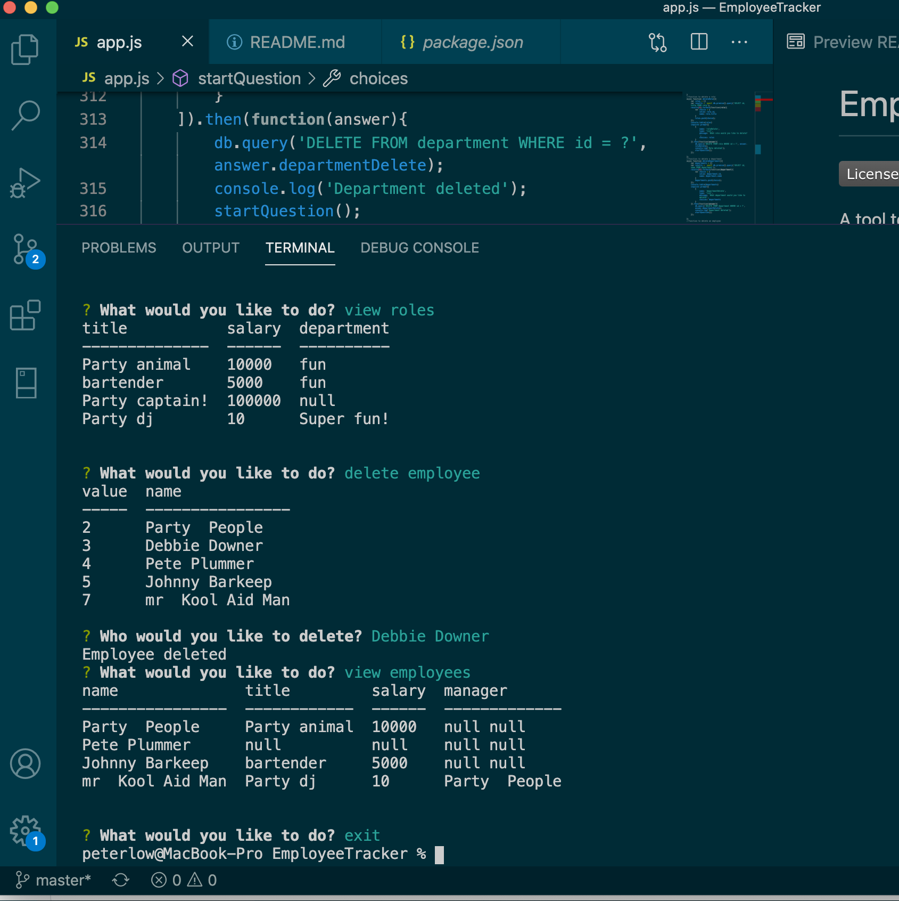
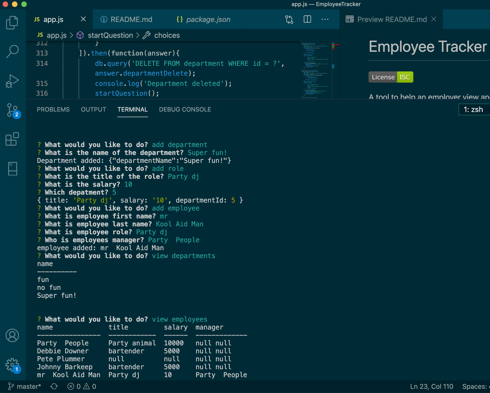
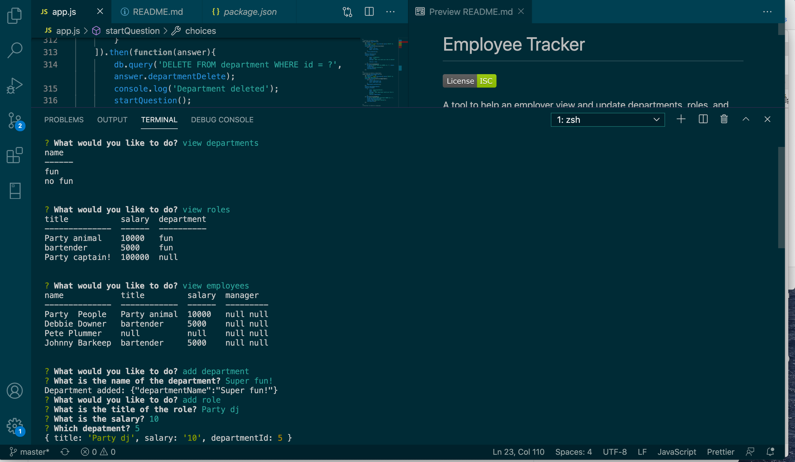

# Employee Tracker

A tool to help an employer view and update departments, roles, and  employees within a company.
## Table of Contents
- [Images](#images)
- [Usage](#usage)
- [Technologies](#technologies)
- [Link To Video](#LinkToVideo)
- [Repository](#repository)
- [Questions](#questions)
## Images

## Usage

The user can add departments, roles and employees using this tool. Departments, roles and employees can also be viewed. When view is selected console table will display the table chosen. Employee roles can also be updated. There is also the ability to delete employees, roles, and departments.
## Technologies

This application uses mySql2, console.table, inquirer as well as a mySql database.

## LinkToVideo
- https://drive.google.com/file/d/1g7e4P348Jofxt9iNoBq1uW-wzhI6JKB6/view

## Repository
- https://github.com/PeteLow-13/EmployeeTracker
## Questions

Contact me via email or github with questions
- pedritolow@gmail.com
- [PeteLow-13](http://github.com/PeteLow-13)